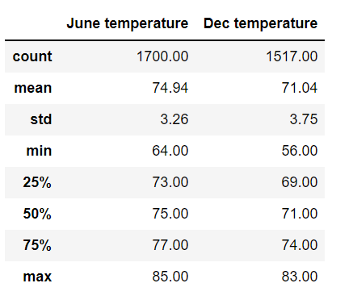
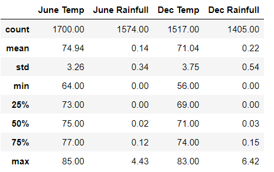

# Surfs_up

## Overview
Using python, pandas functions and SQLalchemy to retreieve the required data with summary statistics.

#### Purpose
The purpose of this analysis is to determine if the surf and ice cream shop business is sustainable year-round with observation of temperature data for the months of June and December from 2010 to 2017 in Oahu.

## Results
Below are the three key takeways in weather between June (Summer) and December(Winter):

- Max temperature are similar , with 85°F in June and  83°F in December
- Min temperature has the greatest variance of 8°F, where 64°F in June and 56°F in December
- Average temperature in June is 3°F higher than in December

 


## Summary
Overall, the temperature in Oahu is relatively the same throughout the year and therefore the surf and ice cream shop business is sustainable year-round.
To further analyze the weather, we have also added rainfull data in June and December, and we came to the conclusion that the average rainfull in June is 11% and in December is 22%, and so the rainfull chance is low and should not affect the sudden drop of temperature that much.

Below are the queries to add the data.

**New Summary**

 

**Adding June precipitation data**

```
june_temp= session.query(Measurement.date, Measurement.tobs,Measurement.prcp ).filter(extract('month', Measurement.date) == 6).all()
new_june_df = pd.DataFrame(june_temp, columns = ["Date", "June Temp", "June Precipitation"])
new_june_df.describe()
```
**Adding Dec precipitaion data**

```
dec_temp= session.query(Measurement.date, Measurement.tobs,Measurement.prcp ).filter(extract('month', Measurement.date) == 12).all()
new_dec_df = pd.DataFrame(dec_temp, columns = ["Date", "Dec Temp", "Dec Precipitation"])
new_dec_df.describe()
```


